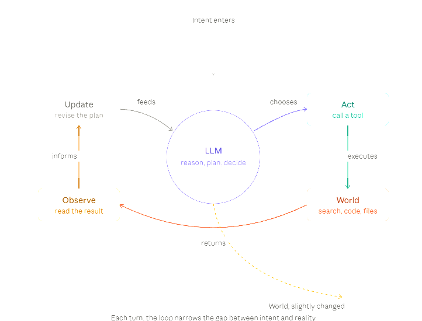

# TankSwarmCode

A real-time 2D tank battle simulator for game AI research, swarm robotics, and competitive programming. Built with C# and .NET 10.



<p align="center">
  
  <br>
  <sub>Commit history, rendered weekly by <a href=".github/workflows/gource-visualization.yml">Gource</a> &middot; <a href="gource-history.mp4">full-quality MP4</a></sub>
</p>

---

## What It Is

Two swarms of tanks fight in a randomly-generated obstacle arena. Each swarm shares radar contacts and broadcasts messages to coordinate. Tanks can fire bullets, maneuver around buildings, and deploy ECM (jamming, spoofing, burnthrough). The simulator runs as a WinForms GUI or as a headless CLI for batch benchmarking.

**Key features:**
- Robocode-style physics (velocity-dependent turning, asymmetric accel)
- Team swarms with shared radar and structured swarm messages
- ECM warfare — jam, spoof, burnthrough modes with energy costs
- Dynamic building obstacles that block movement, bullets, and radar
- GDI+ renderer with animated radar sweeps, ECM auras, and explosion sequences
- Headless CLI for batch runs, parallel execution, and JSON/table/CSV output

---

## Prerequisites

| Requirement | Version |
|---|---|
| .NET SDK | 10.0 |
| OS | Windows 10 or later |

---

## Build & Run

### GUI

```bash
dotnet run --project TankSwarmCode.Gui/TankSwarmCode.Gui.csproj
```

Or open `TankSwarmCode.slnx` in Visual Studio and press F5.

### CLI (headless)

```bash
# Quick head-to-head
dotnet run --project TankSwarmCode.Cli/TankSwarmCode.Cli.csproj -- \
  --bot1 TankSwarmCode.SwarmTanks.Red/bin/Release/net10.0/publish/Red.dll \
  --bot2 TankSwarmCode.SwarmTanks.Blue/bin/Release/net10.0/publish/Blue.dll \
  --format table

# 200-match benchmark (research standard)
TankSwarmCode.Cli \
  --bot1 Red.dll --bot2 Blue.dll \
  --batch 200 --parallel 8 --seed 1000 \
  --on-timeout energy \
  --format table
```

See [Chapter 15: CLI Reference](Documentation/ch15-cli.md) for the full flag list.

---

## The Karpathy Loop (AutoResearch)

Hypothesis-driven experiment cycle for AI balance research:

```
Hypothesize → Design → Run → Analyze → Update hypothesis → repeat
```

Each iteration is one Claude session. See [AutoResearch.md](AutoResearch.md) for the full protocol, known baselines, and analysis guide.

Team-specific variants:
- [Blue Engineering](TankSwarmCode.SwarmTanks.Blue.Engineering/AutoResearch.md)
- [Red Engineering](TankSwarmCode.SwarmTanks.Red.Engineering/AutoResearch.md)

---

## Solution Layout

```
TankSwarmCode.slnx
├── TankSwarmCode.SwarmTank.Interfaces   public API (contracts, models, events, enums)
├── TankSwarmCode.Arena.Interfaces       arena control contract (IArena)
├── TankSwarmCode.SwarmTank              SwarmTankBase abstract class
├── TankSwarmCode.Arena                  ArenaEngine physics & runtime state
├── TankSwarmCode.SwarmTanks.Red         Red Swarm AI (6 tanks)
├── TankSwarmCode.SwarmTanks.Blue        Blue Swarm AI (7 tanks)
├── TankSwarmCode.Gui                    WinForms host and GDI+ renderer
├── TankSwarmCode.Cli                    headless JSON/NDJSON/table/CSV match runner
└── Documentation/                       full documentation (see TOC below)
```

---

## Documentation

| Chapter | Topic |
|---|---|
| [01 — Overview](Documentation/ch01-overview.md) | What is TankSwarmCode, core concepts |
| [02 — Getting Started](Documentation/ch02-getting-started.md) | Build, run, GUI walkthrough |
| [03 — Architecture](Documentation/ch03-architecture.md) | Layer diagram, data flow |
| [04 — Physics Engine](Documentation/ch04-physics-engine.md) | Movement, collision, bullets |
| [05 — Tank AI Framework](Documentation/ch05-tank-ai-framework.md) | SwarmTankBase, lifecycle hooks |
| [06 — Swarm Communication](Documentation/ch06-swarm-communication.md) | Broadcast messages, RadarShare |
| [07 — Radar System](Documentation/ch07-radar-system.md) | Sweep geometry, RadarMap, LOS |
| [08 — Data Models](Documentation/ch08-data-models.md) | TankState, TankCommand, RadarContact |
| [09 — Built-in Tanks](Documentation/ch09-builtin-tanks.md) | Red and Blue swarm roster |
| [10 — Custom Tank](Documentation/ch10-custom-tank.md) | Writing and loading your own swarm |
| [11 — Rendering](Documentation/ch11-rendering.md) | GDI+ renderer, visual layers |
| [12 — Configuration](Documentation/ch12-configuration.md) | Arena settings, physics constants |
| [13 — ECM System](Documentation/ch13-ecm-system.md) | Jam, Spoof, Burnthrough mechanics |
| [14 — Tank Energy](Documentation/ch14-tank-energy.md) | Energy budget, costs, recovery |
| [15 — CLI Runner](Documentation/ch15-cli.md) | Flags, output formats, parallelism |
